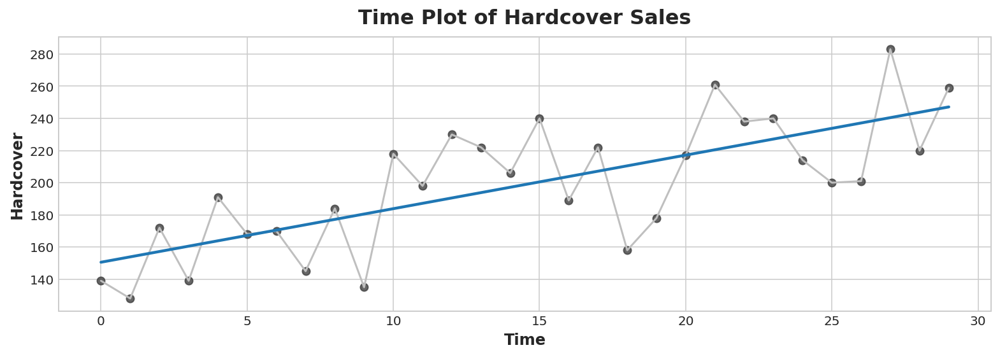

# Linear Regression with Time Series

Based in this kaggle course:
[Linear Regression with Time Series](https://www.kaggle.com/code/ryanholbrook/linear-regression-with-time-series)

**Time Series**:
It's possible to use the index as the timestamp for time series.

**Forecasting**
is the process of predicting the future value of an asset based on the past values.

**Linear Regression**
algorithm learns how to make a weighted sum from its input features. For two features, we would have:

```python
target = w_1 * feature_1 + w_2 * feature_2 + bias
```

During training, the regression algorithm learns values for the parameters weight_1, weight_2, and bias that best fit the target.

* Time-step features are features that comes from:
  * Timestamp column
  * Row indexes

Below is a graph that shows how linear regression (blue line) is able to predict the future value of a time series (gray line).




